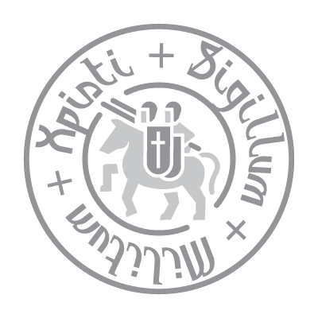

  

# Cryptography Playground
Welcome to the Cryptography Playground! This repository is a collection of functions and implementations for both fundamental and advanced cryptography materials. Whether you're a cryptography enthusiast or a developer looking to implement secure cryptographic algorithms, this playground has something for you.

## Features
- **Constructions**: Explore various cryptographic constructions, including primitives and core building blocks for more complex algorithms.
- **Primitives**: Dive into essential cryptographic primitives such as hashing algorithms and pseudorandom number generators.
- **Game**: Engage in interactive cryptographic challenges and games to test your skills and understanding.
- **Runnable Examples**: Execute provided scripts to see the functions in action and experiment with different parameters.

## Contents
- **core.py**: Contains core building blocks for cryptographic constructions.
- **hash.py**: Implementations of hashing algorithms for data integrity and authentication.
- **pseudorandom.py**: Functions for generating pseudorandom numbers securely.

## How to Use
1. Clone this repository to your local machine using `git clone https://github.com/username/repository.git`.
2. Navigate to the directory containing the repository.
3. Explore the files and folders to understand the available functions and implementations.
4. Run the provided scripts or import the modules into your own projects for cryptographic operations.

## Contributing
Contributions are welcome! If you have any improvements, bug fixes, or new features to add, please submit a pull request. Make sure to follow the repository's guidelines and maintain code quality.

## License
This project is licensed under the [MIT License](LICENSE), which means you are free to use, modify, and distribute the code for both commercial and non-commercial purposes. However, we appreciate attribution to the original authors.